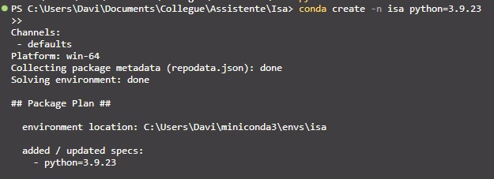
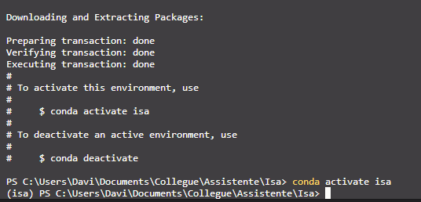
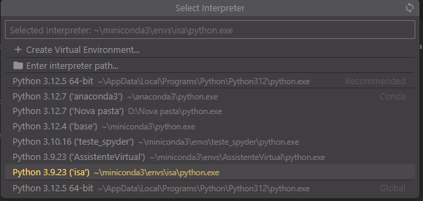

# 🤖 Assistente Virtual - Isa

Isa é uma assistente virtual desenvolvida em Python, capaz de realizar tarefas por comando de voz, como informar a hora, abrir sites, tocar músicas e muito mais. O projeto tem fins acadêmicos e demonstra o uso de automação com voz e web. Futuramente, será integrada com IA local via Ollama.

---

## 🛠️ Tecnologias

O projeto foi inicialmente desenvolvido com **Anaconda Navigator** e **PyCharm**, mas neste guia será apresentada uma alternativa utilizando **VS Code**, pela sua leveza e preferência pessoal.

## ✅ Funcionalidades

- 🕒 Informar a data e hora atual
- 🌐 Acessar sites como Google, YouTube, etc.
- 🎵 Tocar músicas no YouTube Music
- 🧠 Integração com ChatGPT via **Ollama** *(em breve)*
- ☁️ Consultar a meteorologia via API **OpenWeatherMap**


## 🚀 Como usar

### 🔧 Pré-requisitos

- [Anaconda ou Miniconda](https://www.anaconda.com/products/distribution) (Baixado)
- Python **3.9.23**
- Google Chrome instalado
- VS Code (ou PyCharm, opcional)
- Ambiente virtual
- Dependências instaladas via `requirements.txt`

---

### 📥 Instalação

1. **Clone o repositório:**

```bash
git clone https://github.com/DaveBrito/Assistente-Virtual.git
cd Assistente-Virtual 
cd Isa
```
2. **Criação do Ambiente Virtual:**


Como estamos utilizando o Anaconda, não necessito baixar a versão específica do Py em minha máquina. **isa**(nome do ambiente virtual) será criada para demonstrar o guia de instalação para executar nossa Assistente Virtual.
```bash
conda create -n isa python==3.9.23
conda activate isa
```
<p align="center">
  
  
</p>

* Após a criação do ambiente, será necessário selecionar o Interpretador do Py no **VsCode**. Pode utilizar o comando, **Ctrl+Shift+P** como atalho, e selecionar sua versão do ambiente para execução.(isa)

<p align="center">
  
</p>

3. **Instalação de Dependências**


Última etapa será baixar todas as dependências necessárias e importantes para conseguir executar da maneira correta nossa **Isa**. Leva em média de *2 a 3 minutos* para ser baixado todos os pacotes. Após finalizar a instalação, já é possível executar o arquivo principal **Isa.py**
```bash
pip install -r requirements.txt
```
[🔴 Execução da Assistente em Vídeo](https://youtu.be/)
