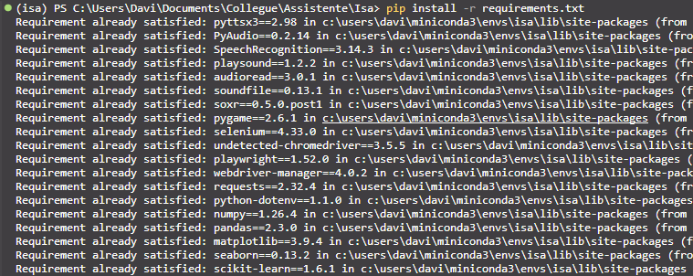

# 🤖 Isa - Assistente Virtual

Isa é uma assistente virtual desenvolvida em Python, capaz de realizar tarefas por comando de voz, como informar a hora, abrir sites, tocar músicas e muito mais. O projeto tem fins acadêmicos e demonstra o uso de automação com voz e web. Futuramente, será integrada com IA local via Ollama.

---

## 📋 Índice

- [🛠️ Tecnologias](#tecnologias)
- [✅ Funcionalidades](#funcionalidades)
- [📋 Pré-requisitos](#pré-requisitos)
- [📥 Instalação](#instalação)
- [🚀 Como usar](#como-usar)
- [🎥 Demonstração](#demonstração)
- [📄 Licença](#licença)

---

## 🛠️ Tecnologias

O projeto foi inicialmente desenvolvido com **Anaconda Navigator** e **PyCharm**, mas neste guia será apresentada uma alternativa utilizando **VS Code**, pela sua leveza e preferência pessoal.

**Principais ferramentas:**
- Python
- Anaconda / Miniconda
- VS Code (ou PyCharm)
- Bibliotecas: speech_recognition, pyttsx3, pywhatkit, requests, entre outras (veja [requirements.txt](Isa/requirements.txt))

---

## ✅ Funcionalidades

| Ícone | Funcionalidade | Status |
|-------|---------------|--------|
| 🕒 | Informar a data e hora atual | ✅ Disponivel |
| 🌐 | Acessar sites como Google, YouTube, etc. | ✅ Disponivel |
| 🎵 | Tocar músicas no YouTube Music | ✅ Disponivel |
| ☁️ | Consultar a meteorologia via API OpenWeatherMap | ✅ Disponivel |

---

## 📋 Pré-requisitos

Antes de começar, certifique-se de ter:

- [✅] Python instalado (Versão para uso : **3.9.23**)
- [✅] [Anaconda ou Miniconda](https://www.anaconda.com/products/distribution) instalado
- [✅] [Google Chrome](https://www.google.com/chrome/) instalado
- [✅] [VS Code](https://code.visualstudio.com/) (ou PyCharm, opcional)
- [✅] Repositório clonado

---

## 📥 Instalação

### 1. Clone o repositório

```bash
git clone https://github.com/Davi-Jr/Assistente-Virtual.git

cd Isa
```

### 2. Crie o ambiente virtual

Como estamos utilizando o Anaconda, **não é necessário baixar uma versão específica do Python separadamente.** O ambiente `isa` será criado para isolar as dependências do projeto.

```bash
conda create -n isa python==3.9.23

conda activate isa
```


> **Dica:** Após criar o ambiente, selecione o interpretador no VS Code. Use o atalho `Ctrl+Shift+P` e selecione a versão do Python do ambiente `isa`.


### 3. Instale as dependências

Última etapa: baixar todas as dependências necessárias. Leva menos de *1 minuto*.

```bash
pip install -r requirements.txt
```



---

## 🚀 Como usar

1. Execute o arquivo principal:
   ```bash
   python Isa.py
   ```

2. A assistente ouvirá seus comandos de voz e responderá automaticamente.

---

## 🎥 Demonstração

Assista ao vídeo de demonstração: [Execução da Assistente em Vídeo](https://youtu.be/67dqmKZ3Sxo)

---

## 📄 Licença

Este projeto é de uso acadêmico. Sinta-se livre para estudar e modificar conforme necessário.

---

